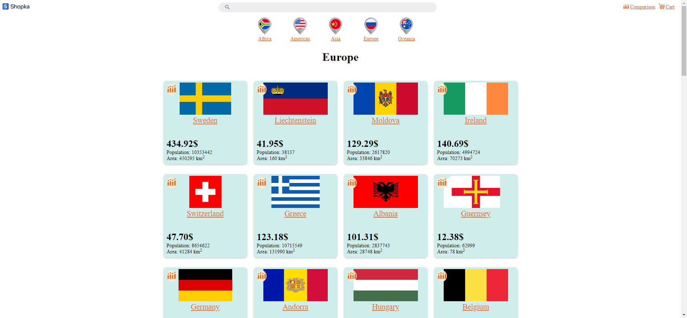
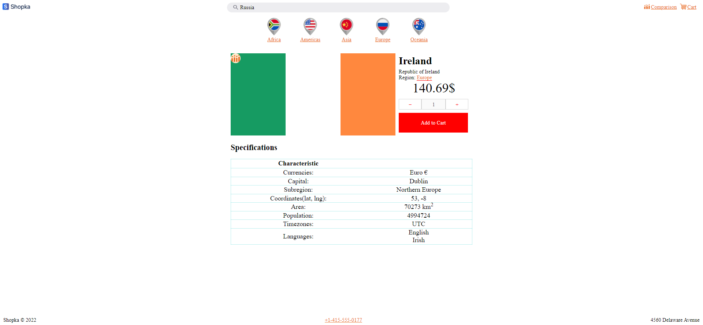

## NEXT JS SHOP COUNTRIES
Search engine by country, the ability to add a country to favorites or to the cart =)  
The cart displays the total amount, the ability to change the number of goods.  
In favorites, you can compare countries by parameters with each other.  
There are 5 categories of countries.  
It is possible to find a specific country through the search.  
Each country page displays data by population, location, language, and currency.  

[Demo](https://next-js-shop-countries.vercel.app/)

## The project used
[Api](https://restcountries.com/), React(component approach, FC, ), CSS (SCSS, modules, flex-box, normalize.css), Media request, Next js.

## The project has implemented

1. Search for counties by name.
2. Added countries to comparison page (LocalStorage).
3. Added shopping cart, with counters, and total price.
4. Components are checked for overflow.
5. Adaptive design (media querry);
6. Added meta tags (next js).
7. Added category pages (regions).
8. Simple design.

## Available Scripts

1. `npm start`
2. `npm run dev`
